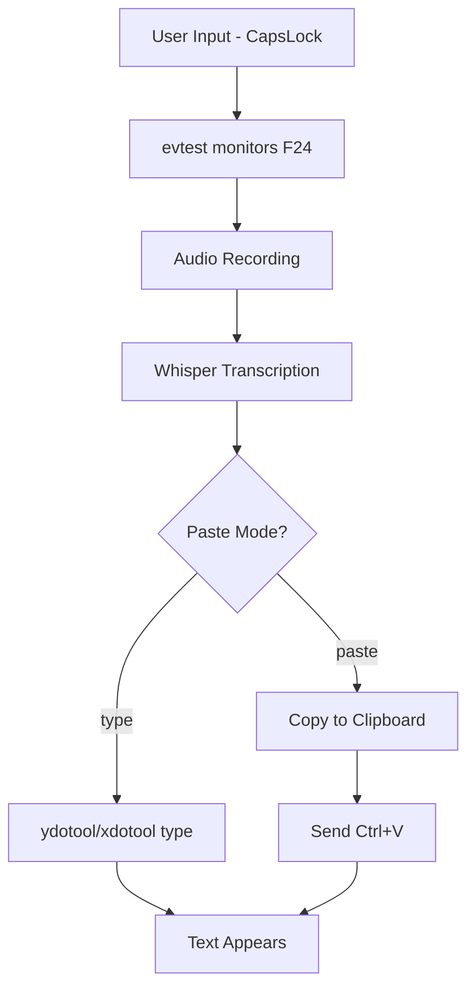

# Push2Type Paste Option

## Executive Summary

Add configurable paste mode to push2type allowing users to choose between character-by-character typing simulation (current behavior) and direct clipboard pasting. This improves compatibility with applications that have issues with simulated typing and provides faster text insertion for large transcriptions.

## Requirements

### Functional Requirements

- **REQ-001**: User can configure paste mode via environment variable `PASTE_MODE`
- **REQ-002**: User can configure paste mode via command-line argument `--paste-mode`
- **REQ-003**: Support two modes: `type` (default, current behavior) and `paste` (new clipboard-based)
- **REQ-004**: In paste mode, transcribed text is copied to clipboard and then pasted via Ctrl+V
- **REQ-005**: Maintain backward compatibility - default behavior remains typing simulation
- **REQ-006**: Both X11 and Wayland clipboard support for paste mode
- **REQ-007**: Fallback gracefully if paste mode fails (clipboard unavailable, target app doesn't support paste)

### Non-functional Requirements

- **PERF-001**: Paste mode should be faster than typing simulation for text >50 characters
- **COMPAT-001**: Must work with existing push2type configuration and keyd setup
- **USABILITY-001**: Clear user feedback indicating which mode is active
- **RELIABILITY-001**: Robust error handling for clipboard operations

### User Stories

```gherkin
Feature: Configurable paste mode
  Scenario: User enables paste mode via environment variable
    Given push2type is configured with PASTE_MODE=paste
    When user holds CapsLock and speaks
    Then transcribed text is copied to clipboard and pasted via Ctrl+V
    
  Scenario: User enables paste mode via command line
    Given user runs push2type --paste-mode=paste
    When user holds CapsLock and speaks
    Then transcribed text is copied to clipboard and pasted via Ctrl+V
    
  Scenario: Paste mode fallback
    Given paste mode is enabled but clipboard is unavailable
    When user holds CapsLock and speaks
    Then system falls back to typing simulation with warning message
```

### Acceptance Criteria

- [ ] Environment variable `PASTE_MODE=paste` enables paste mode
- [ ] Command-line argument `--paste-mode=paste` overrides environment variable
- [ ] Default behavior (typing simulation) unchanged when no configuration set
- [ ] Paste mode works in both X11 and Wayland environments
- [ ] Clear console output indicates active mode on startup
- [ ] Graceful fallback to typing when paste fails
- [ ] Help text documents new configuration options

## Technical Architecture

### System Overview



### Configuration Hierarchy

1. Command-line argument `--paste-mode` (highest priority)
2. Environment variable `PASTE_MODE`  
3. Default: `type` (current behavior)

### Implementation Changes

#### New Configuration Variables
```bash
PASTE_MODE="${PASTE_MODE:-type}"  # type|paste
```

#### New Functions
```bash
# Parse command line arguments for paste mode
parse_paste_args() {
    while [[ $# -gt 0 ]]; do
        case $1 in
            --paste-mode=*)
                PASTE_MODE="${1#*=}"
                shift
                ;;
            --paste-mode)
                PASTE_MODE="$2"
                shift 2
                ;;
            *)
                shift
                ;;
        esac
    done
}

# Paste text via clipboard and Ctrl+V
paste_via_clipboard() {
    local text="$1"
    
    # Copy to clipboard
    if command -v wl-copy >/dev/null; then
        echo -n "$text" | wl-copy
    elif command -v xclip >/dev/null; then
        echo -n "$text" | xclip -selection clipboard
    else
        return 1  # No clipboard available
    fi
    
    # Send Ctrl+V
    if command -v ydotool >/dev/null && pgrep ydotoold >/dev/null; then
        ydotool key ctrl+v
    elif command -v xdotool >/dev/null; then
        xdotool key --clearmodifiers ctrl+v
    else
        return 1  # No paste method available
    fi
}

# Updated paste_text function with mode selection
paste_text_with_mode() {
    local text="$1"
    
    if [[ "$PASTE_MODE" == "paste" ]]; then
        if paste_via_clipboard "$text"; then
            echo -e "${GREEN} Text pasted via clipboard${NC}"
            return 0
        else
            echo -e "${YELLOW}  Paste mode failed, falling back to typing${NC}"
        fi
    fi
    
    # Fall back to typing simulation
    paste_text "$text"
}
```

## Implementation Plan

1. **Phase 1**: Basic configuration parsing
   - Add command-line argument parsing
   - Add environment variable support
   - Update help text

2. **Phase 2**: Clipboard paste implementation
   - Implement `paste_via_clipboard()` function
   - Update `paste_text_with_mode()` wrapper
   - Add mode indication in startup output

3. **Phase 3**: Integration and testing
   - Replace direct `paste_text` calls with `paste_text_with_mode`
   - Test both X11 and Wayland environments
   - Verify fallback behavior

## Validation Strategy

- **Unit tests**: Test configuration parsing and mode selection
- **Integration tests**: Verify paste functionality in different environments
- **Manual testing**: Test with various applications (terminal, browser, text editor)
- **Performance benchmarks**: Compare typing vs paste speed for different text lengths

## Questions for Clarification

1. **Clipboard behavior**: Should paste mode clear the clipboard after pasting, or leave the transcribed text available for manual pasting elsewhere?

2. **Mode switching**: Do you want the ability to toggle between modes during runtime (e.g., via signal), or is startup configuration sufficient?

3. **Application compatibility**: Are there specific applications where you've experienced issues with typing simulation that motivated this request?

4. **Paste timing**: Should there be a small delay before sending Ctrl+V to ensure clipboard is populated, or should it be immediate?

5. **User feedback**: Would you like visual/audio feedback to distinguish between typing and paste modes during operation?